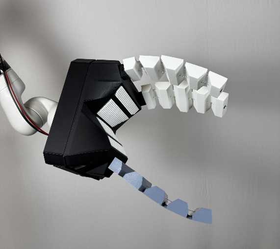
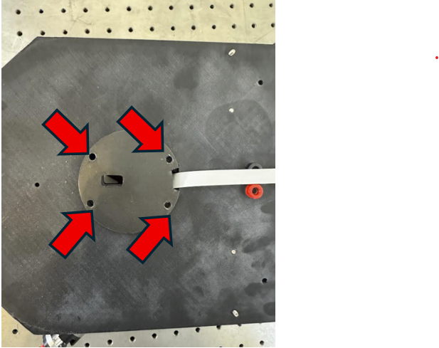

**Introduction**

This gripper is intended to capture various objects, including those that are irregularly shaped. The target application for this gripper is to acquire 3U cube sats in a non-destructive manner. This help document includes assembly instructions, code usage, control, and troubleshooting assistance. Any further questions or concerns should be directed to Nate Billig (nbillig@uwyo.edu).

**Assembly Instructions**

Attaching the gripper to the Kinova requires partial disassembly, outlined below.

**Procedure:**

Begin by connecting the ribbon cable to the Kinovas 20 pin FFC port, located underneath the black guard on the end of the manipulator. Once connected, pass this cable through the corresponding slot in the base and connect it to the 20 pin FFC port on the gripper PCB. Next, attach the base to the Kinova via the 4 screws in the base.

 Next, route the tendons through the load cell mounts as shown in figures 2 and 3. Note that this requires disassembly of the intermediate plate, ensure to reassemble with the tendons properly.

Figure 2 Fully Assembled Load Cell Mount

Figure 3 A cross section of Tendon Routing

Next, attach the intermediate plate with the load cells to the base plate with two screws. Each load cell has colored electrical tape on it, matching one of the motors, and one of the load cell amplifier (LCA) chips. Ensure that the correct load cell is located above its corresponding motor, and plug the load cell into its corresponding LCA, making sure that the connections are made properly (red to red, black to black, white to white, green to green, clear (ground) to yellow).

Figure 4 A top view of the intermediate plate with arrows pointing to mounting holes (No Tendon)

Figure 5 The intermediate plate with load cell assembly (No Tendons)

Next place the top lid over the gripper and route the tendons through the three prominent holes at the base of each finger. Attach the top lid with the screws found on either side

Figure 6 The gripper with the top lid on, and tendons routed through the holes.

Finally, each finger is friction fit into its respective slot, with the tendon being routed up through the internal holes in each finger pad to the terminal link, where it is passed through the bead going up, going down, and then tied to itself using a non-slip knot.

**Specifications**

This gripper is to be used with an external power supply, providing 24V at a maximum of 2A. During usage, Connect the external power supply to the on-board banana jack. **Do not supply more than 24V.**

**Usage**

Prior to usage, be familiar with using the [Kinova Python API.](https://github.com/Kinovarobotics/Kinova-kortex2_Gen3_G3L/tree/master/api_python) This gripper uses the Kinova python API to send commands/read tendon tensions, and is reliant on the *utilities.py* file located in this directory. Necessary code files can be found [here](https://github.com/nbillig/UWYO_Adaptive_Gripper/tree/4999837d67c0267e2666d66756ad830aec4187ae).

* Once the API has been installed, and the pc connected, apply power to Kinova and let it complete its initialization process. Next, apply power to the gripper via the external power supply.
* Once power has been supplied to both the Kinova and the gripper, open the directory in cmd/terminal, and run the python script *10-2-25GripperControl.py.* You should see a message that says **“*Logging as admin on device (IP)*”** then: **“*I2C bridge initialized. Keys: (W,S: Motor1; E,D: Motor2; R,F: Motor3, L: Read Load Cells, Z: Zero Load Cells), ESC to exit*.”** If you do not see these messages, then there is an issue communicating between the computer and the Kinova arm. Ensure that the PC is connected (a quick way to test is to try and use the Kinova web application for manipulator control). Otherwise refer to the I2C [example in the github](https://github.com/Kinovarobotics/Kinova-kortex2_Gen3_G3L/tree/master/api_python/examples/105-Gen3_i2c_bridge) , and the **Troubleshooting** section.
* Once connected, use the controls outlined in the *Controls* section to move the gripper. A very brief description is printed to the CMD window when in use.
  + **Note:** Communication is handled in such a way that each press/hold of a control key only results in one action and there is a cooldown in between actions. This is to ensure that the gripper does not have a “buffer” of commands. **The procedure to use the gripper is**: press a key, wait until the corresponding message is printed out to the CMD window and the action is taken, then press the next key. When actuating the gripper, it is recommended to **increment each motor individually**, and **read each load cell in between commands** to ensure that tensions are within the rated specification (10,000).
  + **Note:** When zeroing the load cells, it may take several seconds for the reading to update, so zero the load cells (Z) then **wait at least 10 seconds** before reading the load cells (L).
  + **Note:** The current reading of the load cells is not calibrated to the true tendon tension, meaning that the values returned when reading load cells is **NOT the tension in each tendon.** Instead, this value is the reading of the load cell in grams.This value is indictive of the tension by a linear relationship, giving a general idea of gripping force. During testing, no damage was found to occur to the gripper before these readings reached 18,000g. It is recommended that while in use **THESE VALUES DO NOT EXCEED 10,000g** for safe operation.
* **Every time the gripper is used the following procedure should be followed during startup:**

1. First, actuate the motors individually until all tendons are tensioned, but the fingers are only slightly bent – This will become the “fully open” position.
2. Press the O key to reset the encoders to 0. This will prevent the motors from moving past this position when opening the gripper.
3. Press Z to zero the load cells to this position. This allows uniform readings in the load cells for all fingers.
4. Begin to use the gripper.

**Troubleshooting**

If when trying to connect to the gripper, the I2C bridge is initialized, but an error is received upon key press, There is most likely an issue communicating between the Kinova and the onboard ESP32. The recommended solution is to power cycle the gripper (Turn off the power supply, wait 10 seconds, turn on the power supply and wait for initialization). This has been observed to occur when power is supplied to the gripper **before** the Kinova. Next, ensure that the ribbon cable is connected properly on both ends. If this does not resolve the issue, check the connections withing the gripper, as one has most likely come loose.

During the event of a suspected system failure, immediately cut power to the gripper and begin disassembly until the failure is found. Replacement parts for most likely breakages have been included. This includes Motor mounts, tension sensing mounts, tendons, and tendon terminal pieces. Refer to the assembly section for direction on how to replace these parts.

**Controls**

Controls are input by the keyboard during use, and are outlined below:

**W – Motor 1 Increment**

**S – Motor 1 Decrement**

**E – Motor 2 Increment**

**D - Motor 2 Decrement**

**R – M3 Increment**

**F – M3 Decrement**

**T – Increment All Motors**

**G – Decrement All Motors**

**O – Reset all encoders to 0**

**P – Set all encoders to maximum**

**L – Read Load Cells**

**Z – Zero Load Cells**

**Note:** The *Reset all encoders to 0* and *set all encoders to maximum* commands are used to set limits on the fingers so that they can return to a set minimum position.

**Connection Guide**

This image gives a general idea of the connections between the motors and the load cells. Ideally, all connections are already made except for the load cells needing to be connected to the LCA. If further connection help is needed, PCB schematics can be sent. For any further assistance, general help, or to request PCB schematics, contact Nate Billig (nbillig@uwyo.edu).
