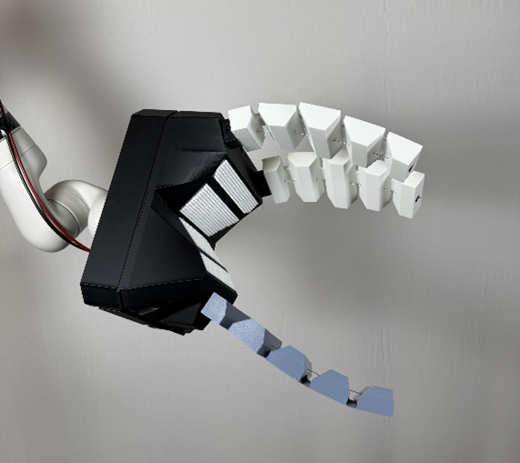
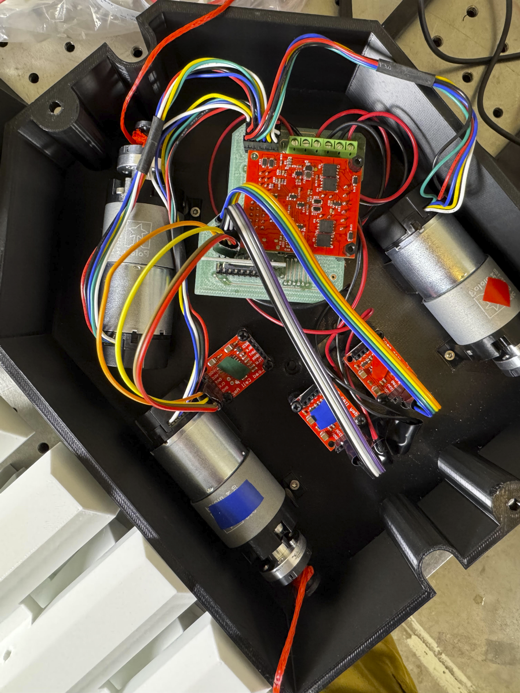

**Introduction**

This gripper is intended to capture various objects, including those that are irregularly shaped. The target application for this gripper is to acquire 3U cube sats in a non-destructive manner. This help document includes assembly instructions, code usage, control, and troubleshooting assistance. Any further questions or concerns should be directed to Nate Billig (nbillig@uwyo.edu).

**Assembly Instructions**
The procedure to attach the gripper to the kinova has been simplified, and now should only take a few minutes. This procedure is outlined below.

**Procedure:**

Before mounting the gripper, ensure that there is a ribbon cable connected to the Kinova's 20 pin FFC port, located underneath the black guard on the end of the manipulator.

Begin by removing the four phillips head screws located on the palm side of the gripper body. This will allow the top plate to seperate from the base, along with all electronics and tendon assemblies. There are two wires connecting the two plates together. Take care not to damage these connections.
  
*Figure 1 A top view of the gripper, showing the palm plate with the four phillips head screws holding the gripper together.*

  
*Figure 2 The opened gripper, after the four screws have been removed. Note the two fragile wires.*  

 Once The gripper has been opened, pass the ribbon cable through the slot in the base plate, and screw the gripper onto the Kinova. Connect the ribbon cable to the 20 pin FFC port on the gripper. 

  
*Figure 3 Mounting holes for attaching to the Kinova.*

Remount the top plate by replacing the four phillips screws removed previously. Finally connect the 24V 1A power supply to the bannana jacks on the bottom plate of the gripper.

  
*Figure 4 Bannana jack on the bottom of the gripper base plate*

**Usage**
*Direct Control via USB-C*
Due to previous connection issues using the Kinova API, a second control method has been implemented in which commands can be sent directly to the onboard Arduino ESP32 through a USB-C connection. This requires no libraries or uploading of code, and can be controlled through the serial monitor of the Arduino IDE. Before operation familiarize yourself with the control scheme outlined below, as well as the Startup and Zeroing Procedure.

First, add the Arduino ESP32 board from the board manager menu in the Arduino IDE.
<video width="640" height="360" controls>
  <source src="Images/InstallBoard.mp4" type="video/mp4">
</video>

Next, ensure power (24V 1A) is supplied to the gripper and the LEDs on the motor controllers are both green. If they are red, cycle the power.

  
*Figure 5 location of green LED on motor controller*

Once power is supplied, connect the Arduino USB-C to the PC running the arduino IDE. Select the COM port which is connected to the Arduino ESP32. Upon opening the Serial Monitor (baud rate 115200) a status line should be continously printed to the Serial Monitor.

The gripper continously sends a status line in the following format:
[READYBIT][LC1][LC2][LC3][M1ENCODER][M2ENCODER][M3ENCODER]
where:
READYBIT = Whether or not the gripper is ready for a command (1 = Ready, 0 = Not Ready)
LC1 = The reading from the load cell associated with motor 1 (in grams)
LC2 = The reading from the load cell associated with motor 2 (in grams)
LC3 = The reading from the load cel lassociated with motor 3 (in grams)
M1ENCODER = The encoder offset from 0 for motor 1
M2ENCODER = The encoder offset from 0 for motor 2
M3ENCODER = The encoder offset from 0 for motor 3

To send commands to the gripper, simply enter them into the Serial Monitor (at 115200 baud rate). Commands are:
M1 [NUM]
M1 ++[NUM]
M1 --[NUM]

M2 [NUM]
M2 ++[NUM]
M2 --[NUM]

M3 [NUM]
M3 ++[NUM]
M3 --[NUM]

TARE
TARE [1|2|3]
STATUS

Where:
M1 [NUM], M2[NUM], or M3[NUM] ------ sets the motor to an absolute encoder position. Encoder positions range from -18000 to 18000. The encoders are set to 0 when the gripper is first powered on. 18000 is the number of encoder counts required to fully close the finger from the open position. So, to fully close the finger attached to motor one (assuming the gripper is fully open) Enter the command "M1 18000". Similarily to half close the finger associated with M2 you enter the command "M2 9000". To send the finger back to its original position (the position it was in when the gripper was first powered on), send "M1 0"

Negative arguments are allowed to account for the case in which power is unexpectedly lost when the gripper is partially closed. By sending negative arguments e.g. "M1 -5000" The finger can open past the initial position.

Absolute encoder postion commands can be sent simultaneously for multi-finger movement. Individual commands are seperated by ";". For example if you want to fully close all three fingers simultaneously, send the command "M1 18000; M2 18000; M3 18000;"

M# ++[NUM] or M# --[NUM]  ------ can be used to send relative encoder count movements. These commands update the absolute encoder count by the amount specified. For example if the M1 encoder count is at 18000 (finger fully closed), and the command "M1 --1000" is sent, then the absolute encoder count will now be 17000, and the finger will open slightly. The same command can be sent again to move the encoder count to 16000, opening the finger slightly more. Similarily "M# ++[NUM]" will increment the absolute encoder count by the NUM specified.

TARE ------ Zeros all load cells. Can be used without arguments e.g. "TARE" to zero all load cells, or can be used with an argumen [1|2|3] to specify which load cell should be zeroed. Example: "tare 1" zeros the load cell associated with motor/finger 1.

STATUS ------ returns the status of the gripper, which is already being printed to the serial monitor every time step. Unnessesary to use when using Arduino command scheme.

*Kinova API*
Prior to usage, be familiar with using the [Kinova Python API.](https://github.com/Kinovarobotics/Kinova-kortex2_Gen3_G3L/tree/master/api_python) This gripper uses the Kinova python API to send commands/read tendon tensions, and is reliant on the *utilities.py* file located in this directory. Necessary code files can be found in the github repository.

* Once the API has been installed, and the pc connected, apply power to Kinova and let it complete its initialization process. Next, apply power to the gripper via the external power supply.
* Once power has been supplied to both the Kinova and the gripper, open the directory in cmd/terminal, and run the python script *10-2-25GripperControl.py.* You should see a message that says **“*Logging as admin on device (IP)*”** then: **“*I2C bridge initialized. Keys: (W,S: Motor1; E,D: Motor2; R,F: Motor3, L: Read Load Cells, Z: Zero Load Cells), ESC to exit*.”** If you do not see these messages, then there is an issue communicating between the computer and the Kinova arm. Ensure that the PC is connected (a quick way to test is to try and use the Kinova web application for manipulator control). Otherwise refer to the I2C [example in the github](https://github.com/Kinovarobotics/Kinova-kortex2_Gen3_G3L/tree/master/api_python/examples/105-Gen3_i2c_bridge) , and the **Troubleshooting** section.
* Once connected, use the controls outlined in the **Controls** section to move the gripper. A very brief description is printed to the CMD window when in use.
  + **Note:** Communication is handled in such a way that each press/hold of a control key only results in one action and there is a cooldown in between actions. This is to ensure that the gripper does not have a “buffer” of commands. **The procedure to use the gripper is**: press a key, wait until the corresponding message is printed out to the CMD window and the action is taken, then press the next key. When actuating the gripper, it is recommended to **increment each motor individually**, and **read each load cell in between commands** to ensure that tensions are within the rated specification (10,000).
  + **Note:** When zeroing the load cells, it may take several seconds for the reading to update, so zero the load cells (Z) then **wait at least 10 seconds** before reading the load cells (L).
  + **Note:** The current reading of the load cells is not calibrated to the true tendon tension, meaning that the values returned when reading load cells is **NOT the tension in each tendon.** Instead, this value is the reading of the load cell in grams.This value is indictive of the tension by a linear relationship, giving a general idea of gripping force. During testing, no damage was found to occur to the gripper before these readings reached 18,000g. It is recommended that while in use **THESE VALUES DO NOT EXCEED 10,000g** for safe operation.
* **Every time the gripper is used the following procedure should be followed during startup:**

1. First, actuate the motors individually until all tendons are tensioned, but the fingers are only slightly bent – This will become the “fully open” position.
2. Press the O key to reset the encoders to 0. This will prevent the motors from moving past this position when opening the gripper.
3. Press Z to zero the load cells to this position. This allows uniform readings in the load cells for all fingers.
4. Begin to use the gripper.

**Troubleshooting**

If when trying to connect to the gripper, the I2C bridge is initialized, but an error is received upon key press, There is most likely an issue communicating between the Kinova and the onboard ESP32. The recommended solution is to power cycle the gripper (Turn off the power supply, wait 10 seconds, turn on the power supply and wait for initialization). This has been observed to occur when power is supplied to the gripper **before** the Kinova. Next, ensure that the ribbon cable is connected properly on both ends. If this does not resolve the issue, check the connections within the gripper, as one has most likely come loose.

During the event of a suspected system failure, immediately cut power to the gripper and begin disassembly until the failure is found. Replacement parts for most likely breakages have been included. This includes Motor mounts, tension sensing mounts, tendons, and tendon terminal pieces. Refer to the assembly section for direction on how to replace these parts.

**Controls**

Controls are input by the keyboard during use, and are outlined below:

**W – Motor 1 Increment**

**S – Motor 1 Decrement**

**E – Motor 2 Increment**

**D - Motor 2 Decrement**

**R – M3 Increment**

**F – M3 Decrement**

**T – Increment All Motors**

**G – Decrement All Motors**

**O – Reset all encoders to 0**

**P – Set all encoders to maximum**

**L – Read Load Cells**

**Z – Zero Load Cells**

**Note:** The *Reset all encoders to 0* and *set all encoders to maximum* commands are used to set limits on the fingers so that they can return to a set minimum position.

**Connection Guide**
This image gives a general idea of the connections between the motors and the load cells. Ideally, all connections are already made except for the load cells needing to be connected to the LCA. If further connection help is needed, PCB schematics can be sent. For any further assistance, general help, or to request PCB schematics, contact Nate Billig (nbillig@uwyo.edu).
  
