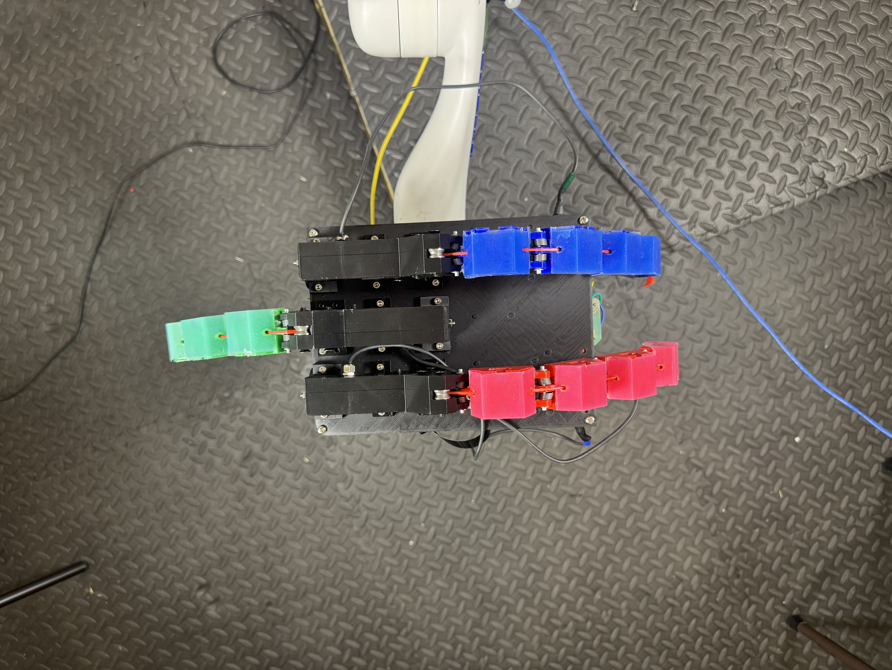
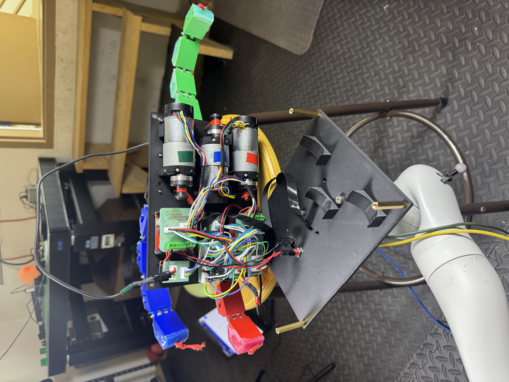
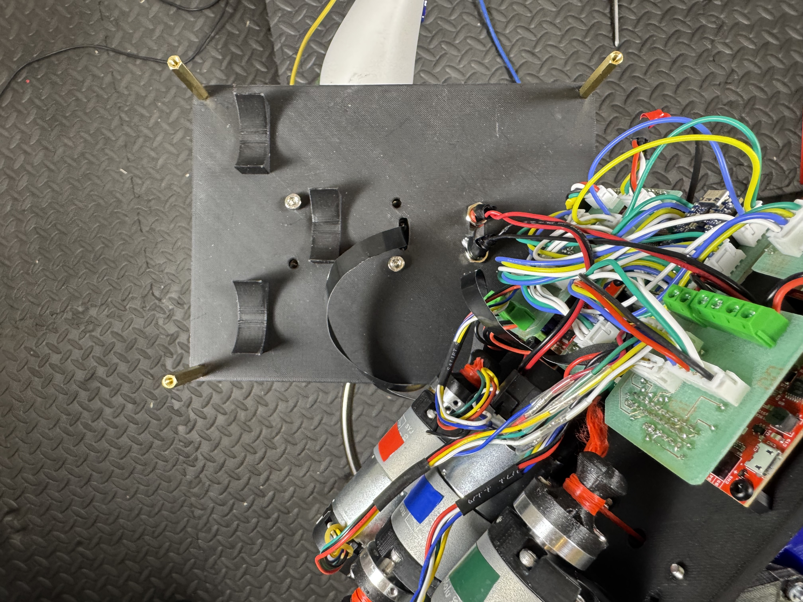
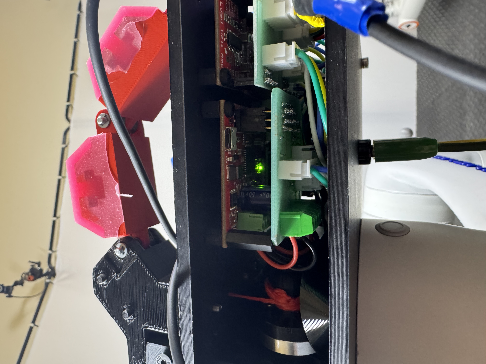
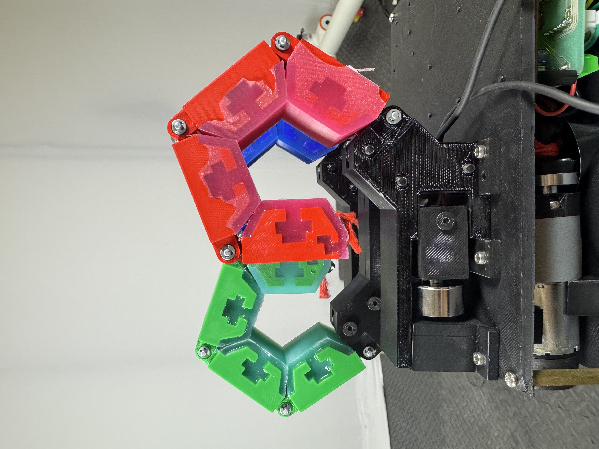
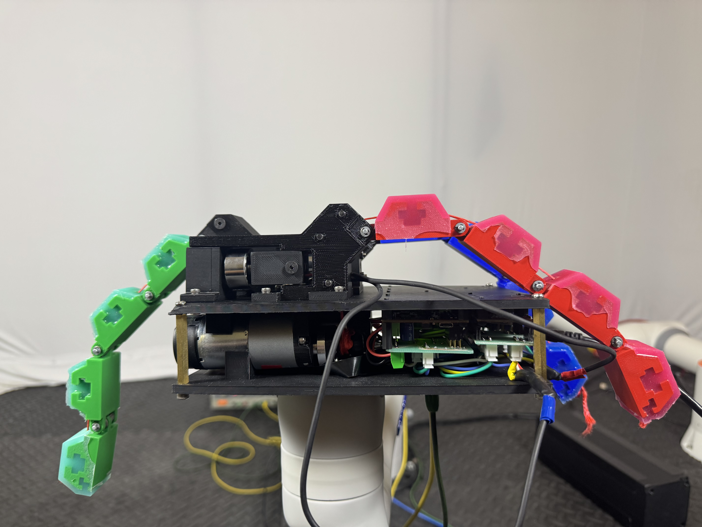

**Introduction**

This gripper is intended to capture various objects, including those that are irregularly shaped. The target application for this gripper is to acquire 3U cube sats in a non-destructive manner. This help document includes assembly instructions, code usage, control, and troubleshooting assistance. Any further questions or concerns should be directed to Nate Billig (nbillig@uwyo.edu).

**Assembly Instructions**
The procedure to attach the gripper to the kinova has been simplified, and now should only take a few minutes. This procedure is outlined below.

**Procedure:**

Before mounting the gripper, ensure that there is a ribbon cable connected to the Kinova's 20 pin FFC port, located underneath the black guard on the end of the manipulator.

Begin by removing the four phillips head screws located on the palm side of the gripper body. This will allow the top plate to seperate from the base, along with all electronics and tendon assemblies. There are four wires connecting the two plates together. Take care not to damage these connections.
  
*Figure 1 A top view of the gripper, showing the palm plate with the four phillips head screws holding the gripper together.*

  
*Figure 2 The opened gripper, after the four screws have been removed. Note the four fragile wires.*  

 Once The gripper has been opened, pass the ribbon cable through the slot in the base plate, and screw the gripper onto the Kinova. Connect the ribbon cable to the 20 pin FFC port on the gripper, which is located on a breakout board in the center of the base.

  
*Figure 3 Mounting holes for attaching to the Kinova.*

Remount the top plate by replacing the four phillips screws removed previously. Finally connect the 24V 1A power supply to the bannana jacks on the bottom plate of the gripper.

  
*Figure 4 Bannana jack on the bottom of the gripper base plate*

**Usage**
*Arduino Direct Control via USB-C*
Due to previous connection issues using the Kinova API, a second control method has been implemented in which commands can be sent directly to the onboard Arduino ESP32 through a USB-C connection. This requires no libraries or uploading of code, and can be controlled through the serial monitor of the Arduino IDE. Before operation familiarize yourself with the control scheme outlined below, as well as the Startup and Zeroing Procedure.

First, add the Arduino ESP32 board from the board manager menu in the Arduino IDE.
<video width="640" height="360" controls>
  <source src="Images/Installboard.gif" type="video/gif">
</video>

Next, ensure power (24V 1A) is supplied to the gripper and the LEDs on the motor controllers are both green. If they are red, cycle the power.

  
*Figure 5 location of green LED on motor controller*

Once power is supplied, connect the Arduino USB-C to the PC running the arduino IDE. Select the COM port which is connected to the Arduino ESP32. Upon opening the Serial Monitor (baud rate 115200) a status line should be continously printed to the Serial Monitor.

The gripper continously sends a status line in the following format:
[READYBIT][LC1][LC2][LC3][M1ENCODER][M2ENCODER][M3ENCODER]
where:
READYBIT = Whether or not the gripper is ready for a command (1 = Ready, 0 = Not Ready)
LC1 = The reading from the load cell associated with motor 1 (in grams)
LC2 = The reading from the load cell associated with motor 2 (in grams)
LC3 = The reading from the load cel lassociated with motor 3 (in grams)
M1ENCODER = The encoder offset from 0 for motor 1
M2ENCODER = The encoder offset from 0 for motor 2
M3ENCODER = The encoder offset from 0 for motor 3

To send commands to the gripper, simply enter them into the Serial Monitor (at 115200 baud rate). Commands are:
**M1 [NUM]**
**M1 ++[NUM]**
**M1 --[NUM]**

**M2 [NUM]**
**M2 ++[NUM]**
**M2 --[NUM]**

**M3 [NUM]**
**M3 ++[NUM]**
**M3 --[NUM]**

**TARE**
**TARE [1|2|3]**
**STATUS**

Where:
M1 [NUM], M2[NUM], or M3[NUM] ------ sets the motor to an absolute encoder position. Encoder positions range from -18000 to 18000. The encoders are set to 0 when the gripper is first powered on. 18000 is the number of encoder counts required to fully close the finger from the open position. So, to fully close the finger attached to motor one (assuming the gripper is fully open) Enter the command "M1 18000". Similarily to half close the finger associated with M2 you enter the command "M2 9000". To send the finger back to its original position (the position it was in when the gripper was first powered on), send "M1 0"

Negative arguments are allowed to account for the case in which power is unexpectedly lost when the gripper is partially closed. By sending negative arguments e.g. "M1 -5000" The finger can open past the initial position.

Absolute encoder postion commands can be sent simultaneously for multi-finger movement. Individual commands are seperated by ";". For example if you want to fully close all three fingers simultaneously, send the command "M1 18000; M2 18000; M3 18000;"

M# ++[NUM] or M# --[NUM]  ------ can be used to send relative encoder count movements. These commands update the absolute encoder count by the amount specified. For example if the M1 encoder count is at 18000 (finger fully closed), and the command "M1 --1000" is sent, then the absolute encoder count will now be 17000, and the finger will open slightly. The same command can be sent again to move the encoder count to 16000, opening the finger slightly more. Similarily "M# ++[NUM]" will increment the absolute encoder count by the NUM specified.

TARE ------ Zeros all load cells. Can be used without arguments e.g. "TARE" to zero all load cells, or can be used with an argumen [1|2|3] to specify which load cell should be zeroed. Example: "tare 1" zeros the load cell associated with motor/finger 1.

STATUS ------ returns the status of the gripper, which is already being printed to the serial monitor every time step. Unnessesary to use when using Arduino command scheme.

*Kinova API*
Prior to usage, be familiar with using the [Kinova Python API.](https://github.com/Kinovarobotics/Kinova-kortex2_Gen3_G3L/tree/master/api_python) This gripper uses the Kinova python API to send commands/read tendon tensions, and is reliant on the *utilities.py* file located in this directory. Necessary code files can be found in the github repository.

* Once the API has been installed, and the pc connected, apply power to Kinova and let it complete its initialization process. Next, apply power to the gripper via the external power supply.
* Once power has been supplied to both the Kinova and the gripper, open the directory in cmd/terminal, and run the python script *Gripper_Simultaneous_Control_Kinova.py* You should see a message that says **“*Logging as admin on device (IP)*”** then: **"=== Gripper I2C Control CLI ===
Commands: set <id> <pos> | setall <m1> <m2> <m3> | stop | tare | status | quit"** If you do not see these messages, then there is an issue communicating between the computer and the Kinova arm, or the Kinova arm and the gripper.
Once connected, the control scheme is very similar to the *Arduino Direct Control via USB-C*. Commands work as described below:

set <id> <pos> ----- This sets a specific motor to an absolute encoder count. Ex "set 1 10000" will set the motor 1 encoder to an absolute position of 10000.

setall <m1> <m2> <m3> ----- This sends a command to move all three motors simultaneously. Ex "setall 10000 9000 8000" will set M1 to 10000, M2 to 9000, M3 to 8000. If you wanted to keep one motor still, say motor 2, then you could send the command with an x in that position: "setall 10000 x 8000". Alternatively you could replace the x with M2's current encoder count.

stop ----- This command reads the absolute encoder position, and commands the motor to move to that position. It does not immediately stop the motors. In the event that motors need to be immediately powered off, turn off the external power supply.

tare ----- This command zeros the load cells. to zero all three load cells: "tare" to specifically tare one load cell "tare 1", "tare 2", or "tare 3"

status ----- This command returns and prints all relevant information about the gripper, including: ready status, load cell readings, and absolute encoder counts.

quit ----- Ends the command session.

*Operation Recommendations*
It is recommended that the motors are actuated in small steps, while reading the load cells in between each step to ensure that excessive pressure is not being applied to the object. I recommend zeroing the load cells at the zero (open) position. Safe operation is generally considered when the load cells read less than 25,000g. Spools generally break around readings of 35,000g or above. I have found forces between 25,000 - 30,000 are more than necessary for grasping most objects, but it depends on the grasping orientation and object being grasped. **Note:** The current reading of the load cells is not calibrated to the true tendon tension, meaning that the values returned when reading load cells is **NOT the tension in each tendon.** Instead, this value is the reading of the load cell in grams.This value is indictive of the tension by a linear relationship, giving a general idea of gripping force.

**Startup and Zeroing Procedure**
This guide outlines the process of the initial zeroing of the encoders and finger positions to make sure that fingers are not overly closed, resulting in broken finger components. This procedure does not need to be done every time the gripper is used, assuming the gripper is only powered off after confirmation that the absolute encoder count for each motor is at 0. Instead, this procedure is meant for first time use, or to rezero the encoders after the gripper was powered off with absolute encoder counts not at 0.
*Procedure:*
First, follow the steps in either the *Arduino Direct Control via USB-C* or the *Kinova API Usage* to power on the gripper and establish the connection. Then increment motors slowly until the fingers are observed to be fully closed (see figure). Note - this may require cycling the power (maybe multiple times depending on original position) to reset the encoder count to move past the -18000/18000 limit. If using the *Arduino Direct Control via USB-C*, disconnect the USB-C from the PC, cycle the power supply, and reconnect the USB-C. This effectively resets the encoder positions to 0. Note - If the USB-C is not disconnected, the Arduino will not restart, and encoder positions will not be reset to 0.

Once the fingers are observed to be fully closed, cycle the power as described above. Now the encoders should all read 0, and the finger should be fully closed. send all three fingers to the minimum position -18000, and cycle the power once more. 

Upon completion, the fingers should be zerod to the fully open position. This means that the encoders all read 0, and the fingers are fully open. Now positions can be sent to the fingers, and the encoder limit of 18000 should correspond to a fully closed finger. This procedure ensures that the encoders for each finger are in sync, and that the gripper can achieve full range of motion.

  
*Figure 6 Gripper with all three fingers fully closed. Note that there are no gaps between finger pads in this configuration.*

  
*Figure 6 Gripper with all three fingers fully Open.*

**Replacing Parts**
During operation if any component should break, immediatly turn off power to the gripper. The most likely component to break is the spool, for which replacements have been sent. Simply remove the 4 philips head screws on the palm plate, remove the D-shaft collar and spool assembly using a small allen wrench, and replace the spool. Make sure to follow the zeroing procedure before resuming normal operation. If anything else should break, or for any other concerns, contact Nate Billig - nbillig@uwyo.edu.

